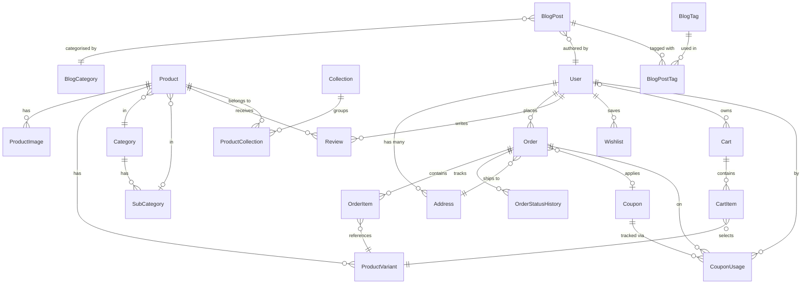

# Database Schema — Vastrayug E-Commerce Platform

> **ORM:** Prisma · **Database:** MySQL · **Version:** 1.0 · **Updated:** 2026-03-06

This document is the canonical reference for all data models before any Prisma schema or migration is written. Every table, column, type, relation, and index is defined here first. Keep this file in sync with `prisma/schema.prisma`.

---

## Table of Contents

1. [Domain Overview](#1-domain-overview)
2. [Entity Relationship Diagram](#2-entity-relationship-diagram)
3. [Naming Conventions](#3-naming-conventions)
4. [Enumerations](#4-enumerations)
5. [Core Models](#5-core-models)
   - [User](#51-user)
   - [Address](#52-address)
   - [Product](#53-product)
   - [ProductImage](#54-productimage)
   - [ProductVariant](#55-productvariant)
6. [Catalogue Models](#6-catalogue-models)
   - [Category](#61-category)
   - [SubCategory](#62-subcategory)
   - [Collection](#63-collection)
7. [Commerce Models](#7-commerce-models)
   - [Cart](#71-cart)
   - [CartItem](#72-cartitem)
   - [Order](#73-order)
   - [OrderItem](#74-orderitem)
   - [OrderStatusHistory](#75-orderstatushistory)
   - [Coupon](#76-coupon)
   - [CouponUsage](#77-couponusage)
8. [Engagement Models](#8-engagement-models)
   - [Review](#81-review)
   - [Wishlist](#82-wishlist)
   - [BlogCategory](#83-blogcategory)
   - [BlogTag](#84-blogtag)
   - [BlogPost](#85-blogpost)
   - [NewsletterSubscriber](#86-newslettersubscriber)
9. [Admin / Marketing Models](#9-admin--marketing-models)
   - [Popup](#91-popup)
   - [Promotion](#92-promotion)
   - [AnnouncementBar](#93-announcementbar)
10. [System Models](#10-system-models)
    - [Settings](#101-settings)
    - [AdminActivityLog](#102-adminactivitylog)
11. [Junction / Pivot Tables](#11-junction--pivot-tables)
12. [Indexes & Performance Notes](#12-indexes--performance-notes)
13. [Data Integrity Rules](#13-data-integrity-rules)
14. [Migration Strategy](#14-migration-strategy)

---

## 1. Domain Overview

Vastrayug is a **premium cosmic-themed e-commerce fashion brand**. The database must support:

| Domain | Key Entities |
|--------|-------------|
| Identity & Auth | `User`, `Address` |
| Catalogue | `Product`, `ProductImage`, `ProductVariant`, `Category`, `SubCategory`, `Collection` |
| Commerce | `Cart`, `CartItem`, `Order`, `OrderItem`, `OrderStatusHistory`, `Coupon`, `CouponUsage` |
| Engagement | `Review`, `Wishlist`, `BlogPost`, `BlogCategory`, `BlogTag`, `NewsletterSubscriber` |
| Marketing | `Popup`, `Promotion`, `AnnouncementBar` |
| System | `Settings`, `AdminActivityLog` |

**Cosmic Metadata** (planet, zodiac, life path number, emotional intention) is a first-class concept — it appears on `Product`, `Collection`, and drives search/filter behaviour.

---

## 2. Entity Relationship Diagram



---

## 3. Naming Conventions

| Rule | Pattern | Example |
|------|---------|---------|
| Table names | PascalCase (Prisma model names) | `OrderItem` |
| Column names | `snake_case` in DB, `camelCase` in Prisma | `created_at` → `createdAt` |
| Primary keys | `id` (CUID — `@default(cuid())`) | `id String @id @default(cuid())` |
| Foreign keys | `{relation}_id` | `user_id`, `category_id` |
| Boolean flags | `is_` prefix | `is_active`, `is_default` |
| Timestamps | `created_at`, `updated_at` | Always UTC |
| Slugs | URL-safe, lowercase, hyphenated | `oversized-tee-saturn` |
| JSON columns | `_json` suffix | `colour_palette_json`, `items_json` |
| Enum fields | ALL_CAPS in SQL, camelCase in Prisma | `SUPER_ADMIN` |

---

## 4. Enumerations

```prisma
enum UserRole {
  SUPER_ADMIN      // Full access to all admin panel features
  CONTENT_MANAGER  // Blog, pop-ups, announcements only
  ORDER_MANAGER    // Orders and users only
  CUSTOMER         // Storefront user
}

enum UserStatus {
  ACTIVE
  INACTIVE
  BANNED
}

enum ProductStatus {
  DRAFT
  PUBLISHED
  ARCHIVED
}

enum OrderStatus {
  PLACED
  PROCESSING
  SHIPPED
  OUT_FOR_DELIVERY
  DELIVERED
  CANCELLED
  REFUNDED
  EXCHANGED
}

enum PaymentStatus {
  PENDING
  PAID
  FAILED
  REFUNDED
}

enum DiscountType {
  PERCENTAGE
  FLAT
}

enum CouponApplicability {
  SITE_WIDE
  CATEGORY
  PRODUCT
}

enum CollectionType {
  PLANETARY    // Navagraha — 9 planets
  ZODIAC       // 12 zodiac signs
  NUMEROLOGY   // Life path numbers 1–9, 11, 22, 33
  VIBE         // Sovereign, Healer, Wanderer, Shadow, Reborn
  RITUAL       // Ritual Essentials / premium cosmic basics
}

enum NavagrahaPlanet {
  SUN      // Surya — Gold, Saffron, Amber
  MOON     // Chandra — Pearl White, Pale Blue, Silver
  MARS     // Mangal — Deep Red, Rust
  MERCURY  // Budh — Emerald, Teal
  JUPITER  // Guru — Royal Yellow, Deep Blue, Gold
  VENUS    // Shukra — Blush, Rose Gold, Ivory
  SATURN   // Shani — Midnight Blue, Black, Indigo
  RAHU     // Rahu — Smoke Grey, Dark Violet
  KETU     // Ketu — Ash White, Maroon, Deep Brown
}

enum ZodiacSign {
  ARIES TAURUS GEMINI CANCER
  LEO VIRGO LIBRA SCORPIO
  SAGITTARIUS CAPRICORN AQUARIUS PISCES
}

enum PopupTrigger {
  DELAY
  SCROLL_DEPTH
  EXIT_INTENT
}

enum PopupFrequency {
  ONCE_SESSION
  ONCE_EVER
  EVERY_VISIT
}

enum ReviewStatus {
  PENDING
  APPROVED
  REJECTED
}

enum BlogPostStatus {
  DRAFT
  PUBLISHED
  SCHEDULED
}
```

---

## 5. Core Models

### 5.1 User

Stores all platform users — customers and admin roles are unified in one table, distinguished by `role`.

| Column | Type | Constraints | Notes |
|--------|------|-------------|-------|
| `id` | String (CUID) | PK | |
| `email` | String | UNIQUE, NOT NULL | |
| `password_hash` | String? | NULLABLE | Null for future social-login users |
| `name` | String | NOT NULL | |
| `phone` | String? | NULLABLE | For SMS via Twilio |
| `role` | `UserRole` | DEFAULT `CUSTOMER` | RBAC |
| `status` | `UserStatus` | DEFAULT `ACTIVE` | |
| `email_verified_at` | DateTime? | NULLABLE | |
| `avatar_url` | String? | NULLABLE | For future social login avatars |
| `created_at` | DateTime | DEFAULT now() | |
| `updated_at` | DateTime | auto-updated | |

**Relations:**
- `addresses` → `Address[]`
- `orders` → `Order[]`
- `reviews` → `Review[]`
- `wishlist` → `Wishlist[]`
- `cart` → `Cart?`
- `blog_posts` → `BlogPost[]` (as author)
- `coupon_usages` → `CouponUsage[]`

**Indexes:** `email` (UNIQUE), `role`, `status`

---

### 5.2 Address

Shipping/billing addresses for a user. Multiple addresses per user, one marked as default.

| Column | Type | Constraints | Notes |
|--------|------|-------------|-------|
| `id` | String (CUID) | PK | |
| `user_id` | String | FK → User | |
| `label` | String? | | e.g., "Home", "Office" |
| `name` | String | NOT NULL | Recipient name |
| `phone` | String | NOT NULL | Delivery contact |
| `line1` | String | NOT NULL | Street address |
| `line2` | String? | NULLABLE | Apartment / landmark |
| `city` | String | NOT NULL | |
| `state` | String | NOT NULL | |
| `postal_code` | String | NOT NULL | |
| `country` | String | DEFAULT `'IN'` | ISO-3166 |
| `is_default` | Boolean | DEFAULT false | |
| `created_at` | DateTime | DEFAULT now() | |

**Indexes:** `user_id`, `(user_id, is_default)`

---

### 5.3 Product

The core catalogue entity. Carries cosmic metadata as first-class fields.

| Column | Type | Constraints | Notes |
|--------|------|-------------|-------|
| `id` | String (CUID) | PK | |
| `title` | String | NOT NULL | |
| `slug` | String | UNIQUE, NOT NULL | URL slug |
| `description` | Text | NOT NULL | Rich HTML — cosmic meaning + fashion details |
| `price` | Decimal(10,2) | NOT NULL | INR |
| `compare_at_price` | Decimal(10,2)? | NULLABLE | Strikethrough price |
| `sku` | String | UNIQUE, NOT NULL | Base SKU |
| `stock` | Int | DEFAULT 0 | Total stock (sum of variant stock if variants used) |
| `category_id` | String | FK → Category | |
| `sub_category_id` | String? | FK → SubCategory | NULLABLE |
| `planet` | `NavagrahaPlanet`? | NULLABLE | Cosmic metadata |
| `zodiac_sign` | `ZodiacSign`? | NULLABLE | Cosmic metadata |
| `life_path_number` | Int? | NULLABLE | 1–9, 11, 22, 33 |
| `emotional_intention` | String? | NULLABLE | e.g., "Confidence", "Healing" |
| `tags` | String? | NULLABLE | Comma-separated or JSON array |
| `meta_title` | String? | NULLABLE | SEO |
| `meta_description` | String? | NULLABLE | SEO |
| `status` | `ProductStatus` | DEFAULT `DRAFT` | |
| `featured` | Boolean | DEFAULT false | Homepage featured flag |
| `created_at` | DateTime | DEFAULT now() | |
| `updated_at` | DateTime | auto-updated | |

**Relations:**
- `images` → `ProductImage[]`
- `variants` → `ProductVariant[]`
- `category` → `Category`
- `sub_category` → `SubCategory?`
- `collections` → `ProductCollection[]`
- `reviews` → `Review[]`
- `wishlist_items` → `Wishlist[]`

**Indexes:** `slug` (UNIQUE), `category_id`, `status`, `planet`, `zodiac_sign`, `life_path_number`, `featured`

> **Full-text search:** Index on `(title, tags, emotional_intention)` — supports autocomplete search by product name, planet, zodiac, collection name.

---

### 5.4 ProductImage

Ordered image gallery per product.

| Column | Type | Constraints | Notes |
|--------|------|-------------|-------|
| `id` | String (CUID) | PK | |
| `product_id` | String | FK → Product | |
| `url` | String | NOT NULL | Hostinger Storage URL |
| `alt_text` | String? | NULLABLE | Accessibility / SEO |
| `sort_order` | Int | DEFAULT 0 | Display order |
| `is_primary` | Boolean | DEFAULT false | Main listing image |

**Indexes:** `product_id`, `(product_id, sort_order)`

---

### 5.5 ProductVariant

A specific size + colour combination under a product, with its own SKU and stock.

| Column | Type | Constraints | Notes |
|--------|------|-------------|-------|
| `id` | String (CUID) | PK | |
| `product_id` | String | FK → Product | |
| `size` | String | NOT NULL | e.g., "XS", "S", "M", "L", "XL", "XXL" |
| `colour` | String? | NULLABLE | e.g., "Cosmic Black", "Nebula Gold" |
| `sku` | String | UNIQUE, NOT NULL | Variant-specific SKU |
| `stock` | Int | DEFAULT 0 | |
| `price_override` | Decimal(10,2)? | NULLABLE | If variant has a different price |
| `is_active` | Boolean | DEFAULT true | |

**Indexes:** `product_id`, `sku` (UNIQUE), `(product_id, size, colour)` UNIQUE

---

## 6. Catalogue Models

### 6.1 Category

Top-level product groupings — physical garment types.

| Column | Type | Constraints | Notes |
|--------|------|-------------|-------|
| `id` | String (CUID) | PK | |
| `name` | String | NOT NULL | e.g., "Oversized Tees", "Hoodies" |
| `slug` | String | UNIQUE, NOT NULL | |
| `description` | Text? | NULLABLE | |
| `image_url` | String? | NULLABLE | Category hero image |
| `sort_order` | Int | DEFAULT 0 | Display order in nav |
| `meta_title` | String? | NULLABLE | SEO |
| `meta_description` | String? | NULLABLE | SEO |
| `created_at` | DateTime | DEFAULT now() | |
| `updated_at` | DateTime | auto-updated | |

**Relations:**
- `sub_categories` → `SubCategory[]`
- `products` → `Product[]`

**Indexes:** `slug` (UNIQUE), `sort_order`

---

### 6.2 SubCategory

Nested under a category. Represents theme groupings (Zodiac, Planet Series, etc.).

| Column | Type | Constraints | Notes |
|--------|------|-------------|-------|
| `id` | String (CUID) | PK | |
| `category_id` | String | FK → Category | |
| `name` | String | NOT NULL | |
| `slug` | String | UNIQUE, NOT NULL | |
| `description` | Text? | NULLABLE | |
| `image_url` | String? | NULLABLE | |
| `sort_order` | Int | DEFAULT 0 | |
| `meta_title` | String? | NULLABLE | SEO |
| `meta_description` | String? | NULLABLE | SEO |
| `created_at` | DateTime | DEFAULT now() | |

**Indexes:** `category_id`, `slug` (UNIQUE)

---

### 6.3 Collection

Thematic groupings that cut across categories — Planetary (Navagraha), Zodiac, Numerology, Vibe & Energy.

| Column | Type | Constraints | Notes |
|--------|------|-------------|-------|
| `id` | String (CUID) | PK | |
| `name` | String | NOT NULL | e.g., "Saturn — Shani Collection" |
| `slug` | String | UNIQUE, NOT NULL | |
| `type` | `CollectionType` | NOT NULL | Enum |
| `description` | Text? | NULLABLE | Cosmic narrative copy |
| `image_url` | String? | NULLABLE | Collection hero image |
| `planet` | `NavagrahaPlanet`? | NULLABLE | For PLANETARY type |
| `zodiac_sign` | `ZodiacSign`? | NULLABLE | For ZODIAC type |
| `life_path_number` | Int? | NULLABLE | For NUMEROLOGY type |
| `colour_palette_json` | Json? | NULLABLE | Planet accent colours per Appendix A |
| `sort_order` | Int | DEFAULT 0 | |
| `is_active` | Boolean | DEFAULT true | |
| `meta_title` | String? | NULLABLE | SEO |
| `meta_description` | String? | NULLABLE | SEO |
| `created_at` | DateTime | DEFAULT now() | |
| `updated_at` | DateTime | auto-updated | |

**Relations:**
- `products` → `ProductCollection[]`

**Indexes:** `slug` (UNIQUE), `type`, `planet`, `zodiac_sign`

---

## 7. Commerce Models

### 7.1 Cart

One cart per user (or session for guests via `session_id`). Persistent for logged-in users.

| Column | Type | Constraints | Notes |
|--------|------|-------------|-------|
| `id` | String (CUID) | PK | |
| `user_id` | String? | FK → User, NULLABLE | Null = guest cart |
| `session_id` | String? | NULLABLE | Guest identification token |
| `coupon_id` | String? | FK → Coupon, NULLABLE | Applied coupon |
| `created_at` | DateTime | DEFAULT now() | |
| `updated_at` | DateTime | auto-updated | |

**Indexes:** `user_id` (UNIQUE — one cart per user), `session_id`

---

### 7.2 CartItem

Line items inside a cart.

| Column | Type | Constraints | Notes |
|--------|------|-------------|-------|
| `id` | String (CUID) | PK | |
| `cart_id` | String | FK → Cart | |
| `product_variant_id` | String | FK → ProductVariant | |
| `quantity` | Int | NOT NULL, min 1 | |

**Indexes:** `cart_id`, `(cart_id, product_variant_id)` UNIQUE

---

### 7.3 Order

A completed purchase. Snapshot of prices at time of order.

| Column | Type | Constraints | Notes |
|--------|------|-------------|-------|
| `id` | String (CUID) | PK | |
| `order_number` | String | UNIQUE, NOT NULL | Human-readable e.g., `VY-20260001` |
| `user_id` | String? | FK → User, NULLABLE | Null for guest checkout |
| `guest_email` | String? | NULLABLE | Guest contact |
| `shipping_address_id` | String | FK → Address | Snapshot stored in order |
| `shipping_address_json` | Json | NOT NULL | Snapshot of address at order time |
| `subtotal` | Decimal(10,2) | NOT NULL | Before discount, shipping, tax |
| `discount_amount` | Decimal(10,2) | DEFAULT 0 | Coupon/promo discount |
| `coupon_id` | String? | FK → Coupon, NULLABLE | |
| `coupon_code_snapshot` | String? | NULLABLE | Store code string in case coupon is deleted |
| `shipping_cost` | Decimal(10,2) | DEFAULT 0 | |
| `tax_amount` | Decimal(10,2) | DEFAULT 0 | |
| `total` | Decimal(10,2) | NOT NULL | Final amount paid |
| `status` | `OrderStatus` | DEFAULT `PLACED` | |
| `payment_status` | `PaymentStatus` | DEFAULT `PENDING` | |
| `razorpay_order_id` | String? | NULLABLE | Razorpay order reference |
| `razorpay_payment_id` | String? | NULLABLE | Confirmed payment ID |
| `tracking_number` | String? | NULLABLE | Admin-entered manually |
| `shipping_provider` | String? | NULLABLE | e.g., "Delhivery", "DTDC" |
| `tracking_url` | String? | NULLABLE | Admin-entered link |
| `exchange_for_order_id` | String? | FK → Order, self-relation | Exchange policy: linked to original |
| `notes` | Text? | NULLABLE | Admin notes / internal |
| `created_at` | DateTime | DEFAULT now() | |
| `updated_at` | DateTime | auto-updated | |

**Relations:**
- `items` → `OrderItem[]`
- `status_history` → `OrderStatusHistory[]`
- `coupon` → `Coupon?`
- `user` → `User?`

**Indexes:** `order_number` (UNIQUE), `user_id`, `status`, `payment_status`, `created_at`

---

### 7.4 OrderItem

Snapshot of each purchased item. Prices are captured at order time — never derived from live product data.

| Column | Type | Constraints | Notes |
|--------|------|-------------|-------|
| `id` | String (CUID) | PK | |
| `order_id` | String | FK → Order | |
| `product_id` | String | FK → Product | Kept for reference |
| `product_variant_id` | String | FK → ProductVariant | |
| `product_title_snapshot` | String | NOT NULL | Name at time of order |
| `variant_snapshot` | Json | NOT NULL | Size + colour at time of order |
| `unit_price` | Decimal(10,2) | NOT NULL | Price at time of order |
| `quantity` | Int | NOT NULL | |
| `line_total` | Decimal(10,2) | NOT NULL | `unit_price × quantity` |

**Indexes:** `order_id`, `product_id`

---

### 7.5 OrderStatusHistory

Immutable audit log of every status change on an order.

| Column | Type | Constraints | Notes |
|--------|------|-------------|-------|
| `id` | String (CUID) | PK | |
| `order_id` | String | FK → Order | |
| `status` | `OrderStatus` | NOT NULL | Status entered |
| `note` | String? | NULLABLE | Admin note at transition |
| `changed_by_user_id` | String? | FK → User, NULLABLE | Admin who made the change |
| `changed_at` | DateTime | DEFAULT now() | |

**Indexes:** `order_id`, `changed_at`

---

### 7.6 Coupon

Flexible discount codes with full rule configuration.

| Column | Type | Constraints | Notes |
|--------|------|-------------|-------|
| `id` | String (CUID) | PK | |
| `code` | String | UNIQUE, NOT NULL | Case-insensitive |
| `description` | String? | NULLABLE | Internal label |
| `discount_type` | `DiscountType` | NOT NULL | |
| `discount_value` | Decimal(10,2) | NOT NULL | % or flat INR |
| `min_order_value` | Decimal(10,2) | DEFAULT 0 | |
| `max_discount` | Decimal(10,2)? | NULLABLE | Cap for percentage discounts |
| `usage_limit` | Int? | NULLABLE | Total redemptions allowed; null = unlimited |
| `per_user_limit` | Int | DEFAULT 1 | |
| `times_used` | Int | DEFAULT 0 | Running counter |
| `valid_from` | DateTime | NOT NULL | |
| `valid_until` | DateTime | NOT NULL | |
| `applicability` | `CouponApplicability` | DEFAULT `SITE_WIDE` | |
| `applicable_ids_json` | Json? | NULLABLE | `{category_ids:[...]}` or `{product_ids:[...]}` |
| `first_order_only` | Boolean | DEFAULT false | |
| `is_stackable` | Boolean | DEFAULT false | Can combine with promotions |
| `is_active` | Boolean | DEFAULT true | |
| `created_at` | DateTime | DEFAULT now() | |
| `updated_at` | DateTime | auto-updated | |

**Relations:**
- `usages` → `CouponUsage[]`

**Indexes:** `code` (UNIQUE), `is_active`, `(valid_from, valid_until)`

---

### 7.7 CouponUsage

Tracks per-user per-order coupon redemption.

| Column | Type | Constraints | Notes |
|--------|------|-------------|-------|
| `id` | String (CUID) | PK | |
| `coupon_id` | String | FK → Coupon | |
| `user_id` | String | FK → User | |
| `order_id` | String | FK → Order | |
| `discount_applied` | Decimal(10,2) | NOT NULL | Actual discount given |
| `used_at` | DateTime | DEFAULT now() | |

**Indexes:** `coupon_id`, `user_id`, `(coupon_id, user_id)`, `order_id`

---

## 8. Engagement Models

### 8.1 Review

Product reviews with moderation.

| Column | Type | Constraints | Notes |
|--------|------|-------------|-------|
| `id` | String (CUID) | PK | |
| `product_id` | String | FK → Product | |
| `user_id` | String | FK → User | |
| `rating` | Int | NOT NULL, 1–5 | |
| `comment` | Text? | NULLABLE | |
| `status` | `ReviewStatus` | DEFAULT `PENDING` | |
| `created_at` | DateTime | DEFAULT now() | |

**Indexes:** `product_id`, `user_id`, `status`, `(product_id, user_id)` UNIQUE — one review per product per user

---

### 8.2 Wishlist

Saved products for a logged-in user.

| Column | Type | Constraints | Notes |
|--------|------|-------------|-------|
| `id` | String (CUID) | PK | |
| `user_id` | String | FK → User | |
| `product_id` | String | FK → Product | |
| `added_at` | DateTime | DEFAULT now() | |

**Indexes:** `user_id`, `(user_id, product_id)` UNIQUE

---

### 8.3 BlogCategory

Content categories for the blog (e.g., "Astrology", "Numerology", "Styling Tips").

| Column | Type | Constraints | Notes |
|--------|------|-------------|-------|
| `id` | String (CUID) | PK | |
| `name` | String | NOT NULL | |
| `slug` | String | UNIQUE, NOT NULL | |
| `created_at` | DateTime | DEFAULT now() | |

---

### 8.4 BlogTag

Free-form tags for cross-cutting blog topics.

| Column | Type | Constraints | Notes |
|--------|------|-------------|-------|
| `id` | String (CUID) | PK | |
| `name` | String | NOT NULL | |
| `slug` | String | UNIQUE, NOT NULL | |
| `created_at` | DateTime | DEFAULT now() | |

---

### 8.5 BlogPost

Rich-content blog posts for SEO and cosmic content strategy.

| Column | Type | Constraints | Notes |
|--------|------|-------------|-------|
| `id` | String (CUID) | PK | |
| `title` | String | NOT NULL | |
| `slug` | String | UNIQUE, NOT NULL | |
| `body` | LongText | NOT NULL | Rich HTML / MDX |
| `excerpt` | Text? | NULLABLE | Auto-truncated or manual |
| `featured_image_url` | String? | NULLABLE | |
| `featured_image_alt` | String? | NULLABLE | SEO |
| `blog_category_id` | String? | FK → BlogCategory, NULLABLE | |
| `author_id` | String | FK → User | |
| `status` | `BlogPostStatus` | DEFAULT `DRAFT` | |
| `published_at` | DateTime? | NULLABLE | Scheduled publish timestamp |
| `is_featured` | Boolean | DEFAULT false | Sticky/featured post |
| `meta_title` | String? | NULLABLE | SEO |
| `meta_description` | String? | NULLABLE | SEO |
| `canonical_url` | String? | NULLABLE | SEO |
| `created_at` | DateTime | DEFAULT now() | |
| `updated_at` | DateTime | auto-updated | |

**Relations:**
- `tags` → `BlogPostTag[]`
- `category` → `BlogCategory?`
- `author` → `User`

**Indexes:** `slug` (UNIQUE), `status`, `published_at`, `blog_category_id`, `is_featured`

---

### 8.6 NewsletterSubscriber

Email list for SendGrid integration. Triggers `Lead` Meta Pixel event.

| Column | Type | Constraints | Notes |
|--------|------|-------------|-------|
| `id` | String (CUID) | PK | |
| `email` | String | UNIQUE, NOT NULL | |
| `source` | String? | NULLABLE | e.g., "footer", "popup" |
| `is_active` | Boolean | DEFAULT true | Unsubscribe flag |
| `subscribed_at` | DateTime | DEFAULT now() | |
| `unsubscribed_at` | DateTime? | NULLABLE | |

**Indexes:** `email` (UNIQUE), `is_active`

---

## 9. Admin / Marketing Models

### 9.1 Popup

Configurable pop-ups for newsletter capture, announcements, welcome messages.

| Column | Type | Constraints | Notes |
|--------|------|-------------|-------|
| `id` | String (CUID) | PK | |
| `title` | String | NOT NULL | Internal admin label |
| `content_json` | Json | NOT NULL | Rich content: text, image, CTA, form fields |
| `trigger_type` | `PopupTrigger` | NOT NULL | DELAY / SCROLL_DEPTH / EXIT_INTENT |
| `trigger_value` | Int? | NULLABLE | Seconds (DELAY) or % (SCROLL_DEPTH) |
| `target_pages_json` | Json? | NULLABLE | `["all"]` or `["/", "/shop"]` |
| `frequency` | `PopupFrequency` | DEFAULT `ONCE_SESSION` | |
| `start_date` | DateTime? | NULLABLE | |
| `end_date` | DateTime? | NULLABLE | |
| `is_active` | Boolean | DEFAULT false | |
| `created_at` | DateTime | DEFAULT now() | |
| `updated_at` | DateTime | auto-updated | |

**Indexes:** `is_active`, `(start_date, end_date)`

---

### 9.2 Promotion

Auto-applied or code-linked discount rules for collections/categories.

| Column | Type | Constraints | Notes |
|--------|------|-------------|-------|
| `id` | String (CUID) | PK | |
| `name` | String | NOT NULL | e.g., "Jupiter Transit — 15% off Guru Collection" |
| `description` | Text? | NULLABLE | |
| `discount_type` | `DiscountType` | NOT NULL | |
| `discount_value` | Decimal(10,2) | NOT NULL | |
| `applicability` | `CouponApplicability` | DEFAULT `SITE_WIDE` | |
| `applicable_ids_json` | Json? | NULLABLE | Category / collection / product IDs |
| `auto_apply` | Boolean | DEFAULT true | false = code required |
| `promo_code` | String? | NULLABLE | If not auto-apply |
| `start_date` | DateTime | NOT NULL | |
| `end_date` | DateTime | NOT NULL | |
| `is_active` | Boolean | DEFAULT false | |
| `created_at` | DateTime | DEFAULT now() | |

**Indexes:** `is_active`, `(start_date, end_date)`

---

### 9.3 AnnouncementBar

Top-of-site promotional strip. Only one active at a time.

| Column | Type | Constraints | Notes |
|--------|------|-------------|-------|
| `id` | String (CUID) | PK | |
| `message` | String | NOT NULL | Short promo text |
| `link_url` | String? | NULLABLE | Optional CTA link |
| `link_text` | String? | NULLABLE | CTA label |
| `bg_colour` | String | DEFAULT `'#C9A84C'` | Hex — Nebula Gold default |
| `text_colour` | String | DEFAULT `'#0A0A0F'` | Hex — Cosmic Black default |
| `is_active` | Boolean | DEFAULT false | |
| `start_date` | DateTime? | NULLABLE | |
| `end_date` | DateTime? | NULLABLE | |
| `created_at` | DateTime | DEFAULT now() | |

**Indexes:** `is_active`

---

## 10. System Models

### 10.1 Settings

Key-value store for all configurable site settings. Admin-editable without code deployments.

| Column | Type | Constraints | Notes |
|--------|------|-------------|-------|
| `key` | String | PK | Setting identifier |
| `value` | Text | NOT NULL | JSON string or plain value |
| `updated_at` | DateTime | auto-updated | |

**Pre-defined keys:**

| Key | Value Format | Description |
|-----|-------------|-------------|
| `store_name` | `"Vastrayug"` | Brand name |
| `store_logo_url` | String | Logo URL |
| `store_favicon_url` | String | Favicon URL |
| `contact_email` | String | Support email |
| `contact_phone` | String | Support phone |
| `social_links` | JSON object | `{instagram, twitter, facebook, youtube}` |
| `gtm_container_id` | String | `GTM-XXXXXXX` |
| `meta_pixel_id` | String | Meta Pixel ID |
| `razorpay_key_id` | String | Payment key |
| `razorpay_mode` | `"test"` or `"live"` | |
| `sendgrid_api_key` | String | |
| `twilio_config` | JSON object | Twilio SID, token, from-number |
| `shipping_config` | JSON object | Zones, rates, free-shipping thresholds |
| `tax_config` | JSON object | Rate %, inclusive/exclusive |
| `email_templates` | JSON object | `{order_confirm, shipping_update, password_reset}` |

---

### 10.2 AdminActivityLog

Immutable audit trail of admin actions.

| Column | Type | Constraints | Notes |
|--------|------|-------------|-------|
| `id` | String (CUID) | PK | |
| `user_id` | String | FK → User | Admin who performed the action |
| `action` | String | NOT NULL | e.g., `PRODUCT_CREATED`, `ORDER_STATUS_UPDATED` |
| `entity_type` | String | NOT NULL | e.g., `Product`, `Order` |
| `entity_id` | String | NOT NULL | ID of affected record |
| `payload_json` | Json? | NULLABLE | Before/after diff or relevant context |
| `ip_address` | String? | NULLABLE | |
| `created_at` | DateTime | DEFAULT now() | |

**Indexes:** `user_id`, `entity_type`, `created_at`

---

## 11. Junction / Pivot Tables

### ProductCollection (Many-to-Many: Product ↔ Collection)

| Column | Type | Constraints |
|--------|------|-------------|
| `product_id` | String | FK → Product |
| `collection_id` | String | FK → Collection |
| `sort_order` | Int | DEFAULT 0 |

**PK:** `(product_id, collection_id)`

---

### BlogPostTag (Many-to-Many: BlogPost ↔ BlogTag)

| Column | Type | Constraints |
|--------|------|-------------|
| `blog_post_id` | String | FK → BlogPost |
| `blog_tag_id` | String | FK → BlogTag |

**PK:** `(blog_post_id, blog_tag_id)`

---

## 12. Indexes & Performance Notes

| Table | Index | Type | Reason |
|-------|-------|------|--------|
| `Product` | `slug` | UNIQUE | URL routing |
| `Product` | `status, featured` | Composite | Homepage + listing queries |
| `Product` | `planet, zodiac_sign, life_path_number` | Individual | Filter by cosmic metadata |
| `Product` | `title, tags` | FULLTEXT | Search autocomplete |
| `Order` | `order_number` | UNIQUE | Customer tracking lookup |
| `Order` | `user_id, created_at` | Composite | Order history pagination |
| `Order` | `status, payment_status` | Composite | Admin order queue |
| `CartItem` | `cart_id, product_variant_id` | UNIQUE | Prevent duplicate cart lines |
| `Coupon` | `code` | UNIQUE | Case-insensitive lookup |
| `BlogPost` | `slug` | UNIQUE | URL routing |
| `BlogPost` | `status, published_at` | Composite | Blog listing, scheduled posts |

---

## 13. Data Integrity Rules

| Rule | Implementation |
|------|---------------|
| Prices in INR only, 2 decimal places | `Decimal(10,2)` on all monetary fields |
| Orders preserve price at purchase time | `unit_price` + snapshot fields on `OrderItem` |
| Guest carts expire | Background job clears carts older than 30 days with no `user_id` |
| One cart per user | UNIQUE index on `Cart.user_id` |
| One review per product per user | UNIQUE index on `(product_id, user_id)` in `Review` |
| Coupons: `times_used` counter | Increment inside a DB transaction with order creation |
| `OrderStatusHistory` is insert-only | Never update or delete; append-only audit log |
| Slugs are validated | URL-safe regex enforced at application layer before insert |
| Addresses snapshot on order | `shipping_address_json` captures full address at checkout — protects historical order data if address is later edited or deleted |
| Settings values are sanitised | API layer validates and sanitises all settings values before write |
| Exchange orders are linked | `exchange_for_order_id` self-FK on `Order` enforces Vastrayug's no-return, exchange-only policy |

---

## 14. Migration Strategy

### Phased Schema Rollout (aligned with PRD Phases)

| Phase | Models Introduced |
|-------|------------------|
| **Phase 1 — MVP** | `User`, `Address`, `Category`, `SubCategory`, `Collection`, `Product`, `ProductImage`, `ProductVariant`, `ProductCollection`, `Cart`, `CartItem`, `Order`, `OrderItem`, `OrderStatusHistory`, `Settings` |
| **Phase 2 — Content & Engagement** | `BlogCategory`, `BlogTag`, `BlogPost`, `BlogPostTag`, `NewsletterSubscriber`, `Popup`, `Promotion`, `AnnouncementBar`, `Coupon`, `CouponUsage` |
| **Phase 3 — Analytics** | No new tables — DataLayer/Pixel events are frontend-only |
| **Phase 4 — Enhancements** | `Review`, `Wishlist`, `AdminActivityLog`; add `avatar_url`, `email_verified_at` to `User` |
| **Phase 5 — Scale** | Evaluate partitioning `Order` and `AdminActivityLog`; add shipping provider API config to `Settings` |

### Prisma Migration Commands

```bash
# Generate migration from schema changes
npx prisma migrate dev --name <migration_name>

# Apply in production
npx prisma migrate deploy

# Seed initial data (categories, collections, settings defaults)
npx prisma db seed
```

### Seed Data Required at Launch

- Default `Settings` key-value rows
- Initial `Category` rows: Oversized Tees, Hoodies, Co-ord Sets, Joggers, Jackets, Kurtas, Accessories
- Initial `Collection` rows: 3–4 Navagraha planets (e.g., Sun, Moon, Saturn, Jupiter) + 5 Vibe collections
- One `User` row: Super Admin account

---

*This schema document is the single source of truth for data modelling on the Vastrayug platform. All Prisma schema definitions, API route logic, and admin panel forms must be built from the models defined here.*
